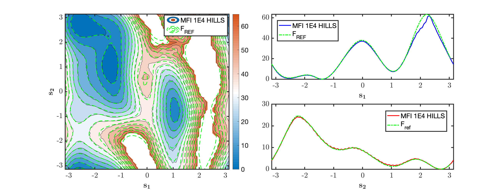

# Mean Force Integration

Inspired by thermodynamic integration, MFI is a method for the calculation of time-independent free energy profiles from history-dependent biased simulations via Mean Force Integration (MFI). MFI circumvents the need for computing the ensemble averages of the bias acting on the system c(t) and can be applied to different variants of metadynamics. Moreover, MFI naturally extends to aggregate information obtained from independent metadynamics simulations, allowing to converge free energy surfaces without the need to sample recrossing events in a single continuous trajectory. 

In this repository we have two example applications of MFI to a double well in 1D and to a Alanine dipeptide. 

The posprocessing scripts are written in matlab and require the following dependencies (for integration): 

**intgrad2.m**: numerical solution of the inverse gradient problem,  
John D'Errico (2021). Inverse (integrated) gradient 
(https://www.mathworks.com/matlabcentral/fileexchange/9734-inverse-integrated-gradient), 
MATLAB Central File Exchange. Retrieved July 4, 2021.

### Comparison MFI (4E3 HILLS) vs. long-time limit MetaD (1E9 HILLS) for Alanine Dipeptide 

 

